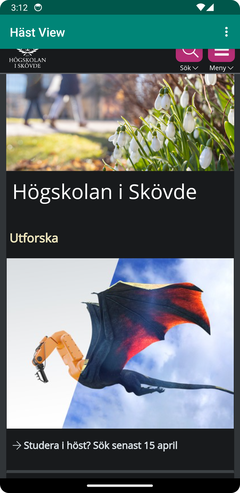
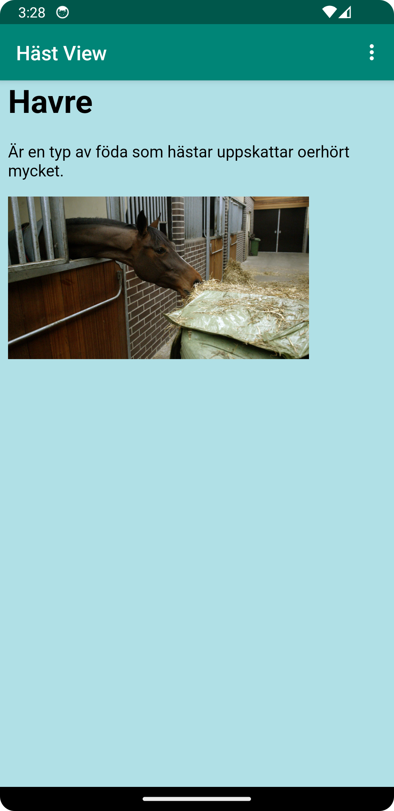

# Rapport

Ett litet förtydligande kring användarnamnet sedan förra inlämingen:
Jag hade missat att det var mitt andra git-hub konto namn, "marazp", som mina commit/pusch hamnade
under. Men jag har nu försökt att åtgärda det så att dom senare commit/pusch som görs hamnar under 
mitt student användarnamn "b23danhe".

För att ändra namnet på appen behövde String variabeln "app_name" ändras på följande sätt:
`<string name="app_name">Häst View</string>`

För att ge appen tillgång till internet lades följande kod till i AndroidManifest.xml:
`<uses-permission android:name="android.permission.INTERNET" />`

Därefter skapades ett nytt WebView element i activity_main.xml med Id: my_webview. Detta element
används för att skapa en ny variabel av typen WebView med namnet myWebView i MainActivity.java.
För att variabeln ska få WebView egenskaperna så kopplas det ihop med det Id som elementet fick 
dvs. my_webview i activity_main.xml.
Därefter skapas en ny WebViewClient i myWebView där Javascript tillåts att köras.

För att skapa en internalWebPage så skapades en ny html-fil där en enkel html kod skrevs in för att
skapa en enkel internalWebPage. Även en bild lades till som sedan länkas in i html-koden.

För att få den externa websidan att läsas in implementerades showExternalWebPage() på följande sätt:
```
private void showExternalWebPage() {
    myWebView.loadUrl("https://his.se");
}
```
På samma sätt implementerades showInternalWebPage() men där används istället fljande url:
```
myWebView.loadUrl("file:///android_asset/about.html");
```
För att få "External Web Page" och "Internal Web Page" knapparna att fungera i dropdown menyn så
anropas metoderna genom att skriva in `showExternalWebPage();` och `showInternalWebPage();` under
motsvarande "action" kopplad till motsvarande menyval i dropdown menyn.

 
